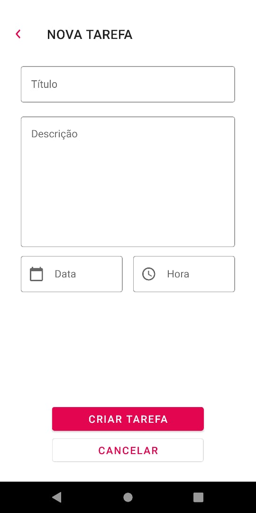
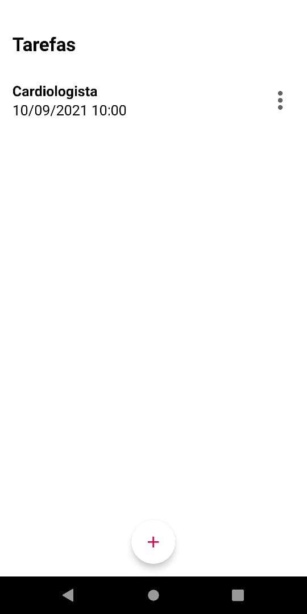
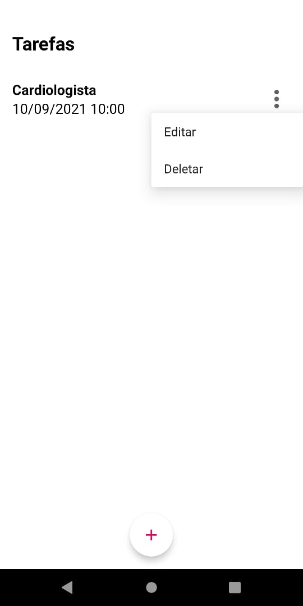

# app Criando Tarefas :📅

App criado em minhas primeiras aulas de Kotlin, através do Android Studio.

app para Criar tarefas do dia a dia.

/

/

/

/

<h5>by Jean da Costa</h5>
<h5>#DigitalInnovationOne</h5>

